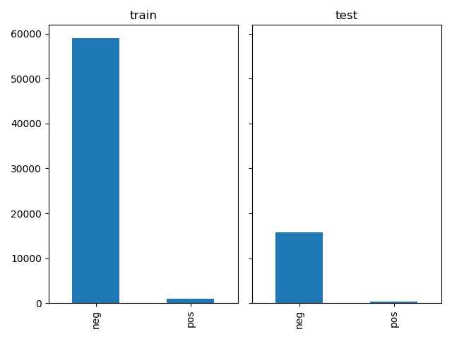
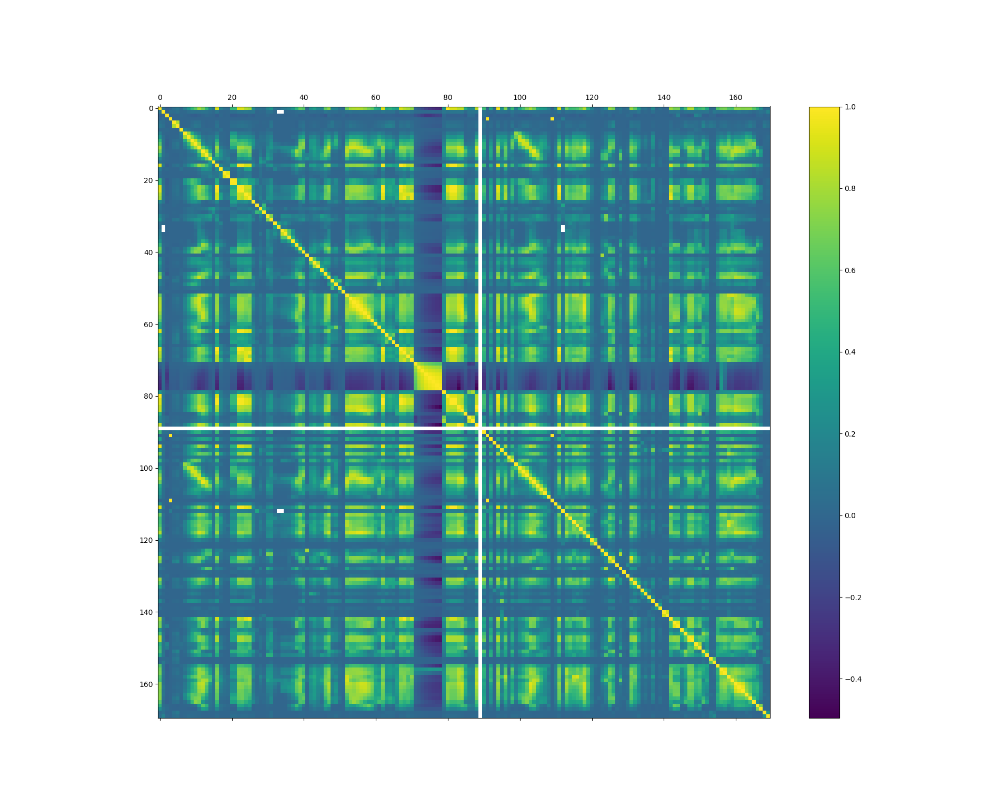

date: 7-10-2019
....


For this assigment I used the following supervised learning methods:

- Random Forest
- Extreme Gradient Boosting (XGBoost)  


## Dataset

### Abstract

According to the  datasets' description,  positive class consists of component failures for a specific component of the APS system. The negative class consists of trucks with failures for components not related to the APS.

The attribute names of the data have been anonymized for proprietary reasons


### Exploratory Data Analysis

During EDA the followings things were observed:

- classes are strong imbalanced (98.3% are negative,  only 1.6 ) 
- a lot of NA values
- a lot of 0 values
- some of the features tend to correlated beteen them (see the correlatioin matrix )


{ width=250px } { width=250px }


## RandomForest Classifier

### Description

Random forests or random decision forests are an ensemble learning method for classification, regression and other tasks that operates by constructing a multitude of decision trees at training time and outputting the class that is the mode of the classes or mean prediction of the individual 


### Basic model


```
rf = RandomForestClassifier(max_depth=100)
rf.fit(X_train, Y_train)

imp.fit(X_test)
X_test = imp.transform(X_test)
Y_pred = rf.predict(X_test)
cm = confusion_matrix(Y_test, Y_pred)
cost_confusion_matrix(cm)
#Restult is 67700

```


We're doing a RandomSearchCV

```
{
'bootstrap': [True, False],
 'max_depth': [10, 20, 30, 40, 50, 60, 70, 80, 90, 100, 110, None],
 'max_features': ['auto', 'sqrt'],
 'min_samples_leaf': [1, 2, 4],
 'min_samples_split': [2, 5, 10],
 'n_estimators': [2, 7, 13, 18, 24, 29, 35, 40, 46, 52]
}
```

And we get best params

```
{
'n_estimators': 40, 
'min_samples_split': 5, 
'min_samples_leaf': 1, 
'max_features': 'sqrt', 
'max_depth': 70, 
'bootstrap': False
}

```


Our cost 51200.


Other random forest
```
{
'n_estimators': [100, 311, 522, 733, 944, 1155, 1366, 1577, 1788, 2000],
'max_features': ['auto', 'sqrt'], 
'max_depth': [10, 20, 30, 40, 50, 60, 70, 80, 90, 100, 110, None],
'min_samples_split': [2, 5, 10], 
'min_samples_leaf': [1, 2, 4], 
'bootstrap': [True, False]
}

```
Finished in about 13 hours
```[Parallel(n_jobs=-1)]: Done 300 out of 300 | elapsed: 795.3min finished```


Best parameters
```
{
'n_estimators': 311, 
'min_samples_split': 2, 
'min_samples_leaf': 1, 
'max_features': 'sqrt', 
'max_depth': None, 
'bootstrap': False
}
```
 
52690

# Feature selection

We try to reduce dimensionality and I used  `SelectFromModel`.  From 170 features, my model got down to 43 features  

