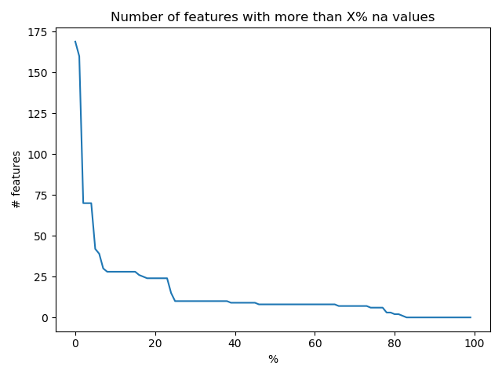
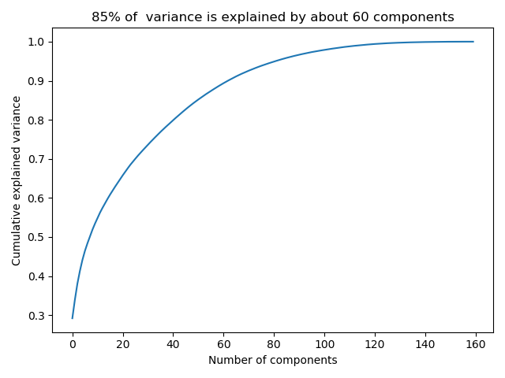
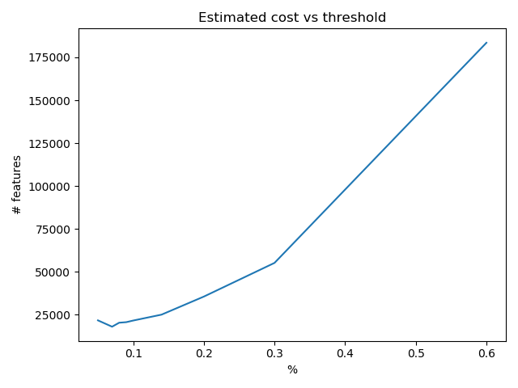
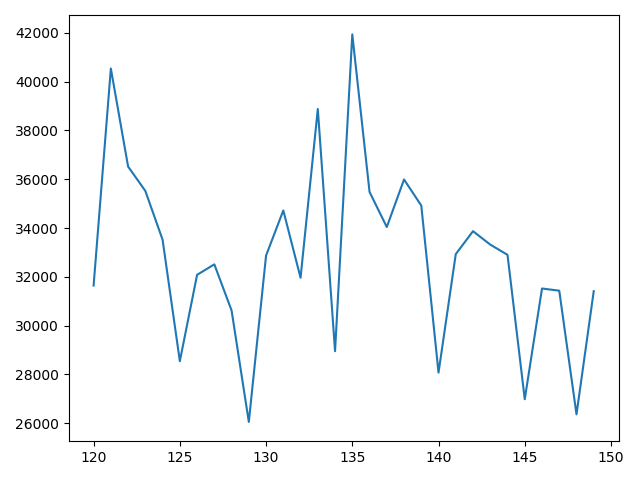
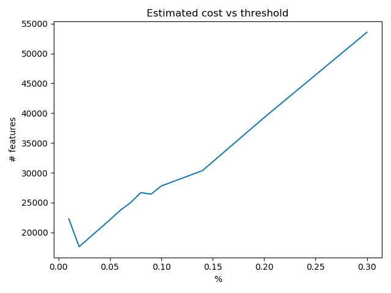

The task is to analyze data collected from heavy Scania trucks in everyday usage which might be correlated
to Air Pressure System (APS) and to find a method to obtimize a cost given a formula based on miss classification

For this assigment I used the following supervised learning methods:

- Random Forest
- Extreme Gradient Boosting (XGBoost)  


## Dataset

### Abstract

From dataset's description:

> According to the  datasets' description,  positive class consists of component failures for a specific component of the APS system. The negative class consists of trucks with failures for components not related to the APS.
> The attribute names of the data have been anonymized for proprietary reasons

> The dataset contains 170 features and 60000 samples for the training set 


### Exploratory Data Analysis

During EDA the followings things were observed:

- I had to skip some lines from the csv files because it contained description 
- classes are strong imbalanced (98.3% are negative,  only 1.6% positive ) 
- a lot of `NA` values
- a lot of 0 values
- some of the features tend to correlated beteen them (see the correlatioin matrix )
- one column has 0 standard variation (cd_000)
- all features are numeric


{ width=32% } { width=32% } { width=32% }


## RandomForest Classifier

### Description

Random forests or random decision forests are an ensemble learning method for classification, regression and other tasks that operates by constructing a multitude of decision trees at training time and outputting the class that is the mode of the classes or mean prediction of the individual 


### Basic model


Applying a simple model of RandomForestClassifier has  a result of  52670$ applying a mean . 


### Tuning hyperparameters

To find the optimal hyperparameters, its commont to think of set of candidate hyper parameters, 
train models and compare their performance via cross validation. Where there are many parameters `Randomized Search Cross Validation` is
recommended [<sup>1</sup>](#ref1)


I'm doing a RandomSearchCV to find best parameters for the model

```
{
'n_estimators': [100, 311, 522, 733, 944, 1155, 1366, 1577, 1788, 2000],
'max_features': ['auto', 'sqrt'], 
'max_depth': [10, 20, 30, 40, 50, 60, 70, 80, 90, 100, 110, None],
'min_samples_split': [2, 5, 10], 
'min_samples_leaf': [1, 2, 4], 
'bootstrap': [True, False]
}
```

One problem was the time it took 14 hours to find these parameters

```[Parallel(n_jobs=-1)]: Done 300 out of 300 | elapsed: 795.3min finished```

Best parameters
```
{
'n_estimators': 311, 
'min_samples_split': 2, 
'min_samples_leaf': 1, 
'max_features': 'sqrt', 
'max_depth': None, 
'bootstrap': False
}
```


Having in mind the costs function for FP and FN, I runned RandomSearch with a custom scoring function getting
different  parameterd and I got different parameters optimized for my model:  `max_depth=30, n_estimators=600`.
 

Using different imputation methods and  parameters obtained after RandomSearch

| name                        | cost  | accuracy | neg_precision | neg_f1_score | pos_precision | pos_f1_score |
|-----------------------------|-------|----------|---------------|--------------|---------------|--------------|
| mean_basic                  | 52670 | 0.9924   | 0.9933        | 0.9961       | 0.9408        | 0.8157       |
| mean_tuned                  | 48210 | 0.9927   | 0.9939        | 0.9963       | 0.93          | 0.8267       |
| mean_tuned-scoring          | 49220 | 0.9925   | 0.9938        | 0.9962       | 0.9264        | 0.822        |
| median_basic                | 56630 | 0.9921   | 0.9928        | 0.996        | 0.9527        | 0.8062       |
| median_tuned                | 51710 | 0.9922   | 0.9934        | 0.996        | 0.9283        | 0.8144       |
| median_tuned-scoring        | 51220 | 0.9922   | 0.9935        | 0.996        | 0.9254        | 0.8149       |
| most_frequent_basic         | 50690 | 0.9925   | 0.9936        | 0.9962       | 0.9352        | 0.8204       |
| most_frequent_tuned         | 48190 | 0.9928   | 0.9939        | 0.9963       | 0.9362        | 0.8291       |
| most_frequent_tuned-scoring | 51190 | 0.9924   | 0.9935        | 0.9961       | 0.9349        | 0.8186       |
| smote-median                | 35220 | na       | na            | na           | na            | na           |


From this moment I used mean imputer for all models. With more process power and time all the variations should
be tried.

### Oversampling

One of the problem of the data is the fact that classes are highly unbalanced. Applying SMOTE (SYNTHETIC MINORITY OVERSAMPLING TECHNIQUE)
added a big improvement  to the results (see the above table) 

### Reducing dimensionality 


One way of reducing dimensionality is by applying Principal Component Analysis (PCA). In this way we can see that we can have 80 featyre

{ width=32% }

I tried  different number of components to be retained with PCA and results got better results for cost reduction


| name                        | cost  | accuracy | neg_precision | neg_f1_score | pos_precision | pos_f1_score |
|-----------------------------|-------|----------|---------------|--------------|---------------|--------------|
| pca50                       | 55100 | 0.9772   | 0.9933        | 0.9884       | 0.3067        | 0.3866       |
| pca100                      | 45830 | 0.9769   | 0.9945        | 0.9883       | 0.2453        | 0.3327       |
| pca150                      | **31940** | 0.978    | 0.9963        | 0.9888       | 0.216         | 0.3152       |
| pca160                      | 39330 | 0.9778   | 0.9953        | 0.9887       | 0.2453        | 0.3407       |


## Adjust the decision threshold

The model is able to return probabilities for each class, so I can try to fit the right threshold that will balance
one class or another

``` 
Y_prob = model.predict_proba(X_test_pca)

t_values = [0.05, 0.6, 0.07, 0.08, 0.09, 0.1, 0.14, 0.2, 0.3]
t_costs = []
for t in t_values:
    predicted = (Y_prob[:, 1] >= t).astype('int')
    t_costs.append(cost_confusion_matrix(confusion_matrix(Y_test, predicted)))

```

And we'll get this plot and find the value `t_values[np.argmin(t_costs)]` of 0.07 getting a cost of 17920

{width=35%}


## Extreme Gradient Boosting (XGBoost)

### The model

Extreme Gradient Boosting is also known as XGBoost. XGBoost is also an ensemble learning method that favor trees with small depth. This model is preferred due to its execution speed and learning performance. 


### Running against the data

Using the same methods of RandomizedSearchCV  we get  better these results on un original data, with a cost of 44150$ vs 48190$. This time
the model with parameters found using the custom score methods gave a better result

| name           | cost  | accuracy | neg_precision | neg_f1_score | pos_precision | pos_f1_score |
|----------------|-------|----------|---------------|--------------|---------------|--------------|
| best1          | 45170 | 0.9933   | 0.9943        | 0.9966       | 0.9437        | 0.8419       |
| best2          | 44150 | 0.9936   | 0.9944        | 0.9967       | 0.9503        | 0.8479       |
| basic          | 59690 | 0.9914   | 0.9924        | 0.9956       | 0.9309        | 0.7877       |
| xgboost-pca160 | 36360 | 0.9779   | 0.9957        | 0.9888       | 0.2373        | 0.3352       |
| xgb-pca150     | 29540 | 0.9777   | 0.9966        | 0.9887       | 0.1893        | 0.2846       |
| xgb-pca150     | 28070 | 0.9777   | 0.9968        | 0.9887       | 0.1813        | 0.2759       |
| xgb-pca140     | 32870 | 0.9783   | 0.9962        | 0.989        | 0.2347        | 0.3365       |
| xgb-pca129     | **26050** | 0.9781   | 0.9971        | 0.9889       | 0.1867        | 0.2851       |


Running PCA component on different values I was able to find a better value for number of components, looking at the graph
we can see that cost is 25050 for n=129 

{ width=32% }


## Comparing results


XGBoost performed better than RandomForest from the begging and also after applying different enhancements.

In order to achieve better results data processing is necessary and PCA was  a good method to achieve
an improvement of 35% for XGBoost and 40% for Random Forest method  

## Adjust the decision threshold

Applyting same technique we as to Random Forest results I deteced a 0.02 value for threshold and a cost of 17610 (the lowest found in this paper)

{width=35%}

## Conclusions

Comparing to baseline model that would classify all trucks Ok which would have a cost of 187500$ for the test samples we obtained
a cost of ***17610$*** 

In order to speed development a developer should build a small library to be able to compare  results against different parameters

Dimensionality should be reduced at first in order to take less time in tunning hyper-parameters

Further work should be made on:

    - combining RandomizedSearchCV over processed dataset with feature reduction (PCA) and oversampling (SMOTE)  
    - deeper analysis of data and feature engineering based on how features corelate with each other


## Files in the project

- eda.py - analyze data: na values, heatmap
- rf_compare.py - different combinations of parameters for Random Forest
- rf_threshold.py- applying threshold  + PCA  and finding best value for threshold
- rf_hyper_tune.py - finding best params for RandormForest
- xgboost_compare.py - different combination of parameters for XGBoost
- xgboost_hyper_tune.py - finding best params for RandomForest.
- xgboost_threshold.py  - finding the optimum threshold

## Referencess 

<a name="ref1"></a> 1. Géron, A. (2017), Hands-on machine learning with Scikit-Learn and TensorFlow : concepts, tools, and techniques to build intelligent systems , O'Reilly Media , Sebastopol, CA .
@book{géron aurélien_2019, place={Beijing ; Boston ; Farnham ; Sebastopol ; Tokyo}, title={Hands-on machine learning with Scikit-Learn and TensorFlow: concepts, tools, and techniques to build intelligent systems}, publisher={OReilly}, author={Géron Aurélien}, year={2019}}